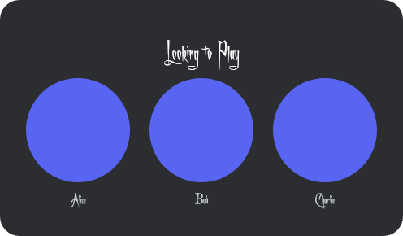

# Looking-2-Play Discord Bot 🎮

A "looking to play" (LFG) bot. A user runs `/play` and the bot posts a box
with their profile picture as a circle and a **Play** button. Others press
**Play** to join — their circular avatar appears next to the first person —
and they can press **Leave** to drop out. The lobby image re-renders every
time someone joins or leaves.

Lobbies are capped at **5 players** (a Valorant stack); once full the Join
button greys out. The lobby **creator** can press **Disband** to close it at
any time (other people pressing Disband get a private "creator only" notice).

Each lobby also gets its own **private voice channel** named `L2p-1`, `L2p-2`,
… (numbered by how many lobbies are open) that only the lobby's members can
see and join. A lobby that sits with no one but the creator for **1 hour**
auto-expires; the moment anyone joins, that expiry is cancelled for good.



> **Note about the buttons:** Discord buttons are shared by *everyone* who
> sees the message — one button can't say "Play" for one person and "Leave"
> for another at the same time. So this bot shows **both** a green **Play**
> button and a red **Leave** button. The bot knows who clicked: Play adds you,
> Leave removes you, and it privately tells you if you're already in. This is
> how every LFG bot handles it, and it gives the exact join/leave behaviour
> you wanted.

---

## What you'll need

- [Node.js](https://nodejs.org/) **v18 or newer** (`node --version` to check)
- A Discord account and a server (guild) where you have **Manage Server**

---

## Step 1 — Create the bot application

1. Go to the [Discord Developer Portal](https://discord.com/developers/applications).
2. Click **New Application**, give it a name (e.g. "Looking2Play"), create it.
3. Open the **Bot** tab → **Reset Token** → **Copy**. This is your
   `DISCORD_TOKEN`. **Keep it secret** — anyone with it controls your bot.
4. On the **General Information** tab, copy the **Application ID**. That's your
   `CLIENT_ID`.

You do **not** need any "Privileged Gateway Intents" for this bot.

## Step 2 — Invite the bot to your server

1. In the Developer Portal go to **Installation** (or **OAuth2 → URL Generator**).
2. Under **Scopes** tick `bot` and `applications.commands`.
3. Under **Bot Permissions** tick:
   - **Send Messages**
   - **Embed Links**
   - **Attach Files**
   - **Use Slash Commands**
   - **Manage Channels** ← needed to create each lobby's voice channel
   - **Move Members** (optional, only if you later auto-move people into the VC)

   > If the bot can't create voice channels, double-check it has **Manage
   > Channels**. Without it the lobby still works, it just won't get a VC.
4. Copy the generated URL, open it in your browser, and add the bot to your server.

## Step 3 — Create the role and channel

1. In your server: **Server Settings → Roles → Create Role**, name it
   exactly `looking2play` (or whatever you set in `.env`). Give it to anyone
   allowed to start lobbies.
2. Create a text channel called `Looking-2-play`.
3. (For copying IDs) enable **User Settings → Advanced → Developer Mode**.
   Then right-click the channel → **Copy Channel ID**, and right-click your
   server icon → **Copy Server ID**.

## Step 4 — Configure the project

```bash
cp .env.example .env
```

Open `.env` and fill in:

| Variable             | What it is                                                        |
| -------------------- | ----------------------------------------------------------------- |
| `DISCORD_TOKEN`      | Bot token from Step 1                                              |
| `CLIENT_ID`          | Application ID from Step 1                                         |
| `GUILD_ID`           | Your server ID (Step 3) — makes `/play` appear instantly          |
| `REQUIRED_ROLE_NAME` | `looking2play` to gate the command, or leave blank for everyone   |
| `LFG_CHANNEL_ID`     | The `#Looking-2-play` channel ID to lock it there, or leave blank |

## Step 5 — Install and register the command

```bash
npm install        # installs discord.js + canvas
npm run deploy     # registers the /play slash command in your server
```

You only need to re-run `npm run deploy` if you change the command itself.

## Step 6 — Run the bot

```bash
npm start
```

You should see `Logged in as <name>. Ready!`. Now go to your
`#Looking-2-play` channel and type `/play`. 🎉

---

## How it works (the code)

- **`src/deploy-commands.js`** — registers the `/play` slash command with
  Discord. Run once via `npm run deploy`.
- **`src/render-lobby.js`** — uses `@napi-rs/canvas` to draw the box: it loads
  each player's avatar, clips it into a circle, and lays them out in a row with
  their names. Uses your `Achafont.ttf` for the text.
- **`src/index.js`** — the bot itself:
  - On `/play` it builds a lobby (the caller is the first player) and posts the
    image + embed + Play/Leave buttons.
  - It keeps each lobby in memory keyed by the message ID.
  - On **Join**, it adds the clicker, grants them voice-channel access and
    re-renders; on **Leave**, it removes them. If everyone leaves, the lobby
    (and its voice channel) closes.
  - On creation it spins up a private `L2p-<n>` voice channel and starts a
    1-hour expiry timer that's cancelled permanently as soon as someone joins.

## Things you might want to add next

- **Persistence:** lobbies live in memory and reset when the bot restarts.
  Swap the `lobbies` Map for a database (SQLite/Redis) to survive restarts.
- **Player cap:** currently 5 (the `MAX_PLAYERS` constant in `src/index.js`) —
  change it for other games. The expiry window is the `EXPIRY_MS` constant.
- **Auto-move:** drop joined players straight into the VC (needs Move Members).
- **Hosting:** run it 24/7 on a small VPS, Railway, Fly.io, etc. (keep your
  `.env` secret — never commit it).
